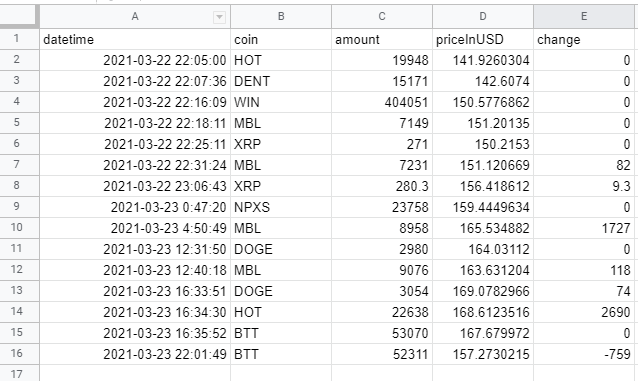

This script copies and append non-existent deals from the history of deals binance-trade-bot to the google table.

Need to download credentials.json by click on button `enable the google Sheet API` from next link https://developers.google.com/sheets/api/quickstart/python

Change `spreadsheet_id` and `current_scope` in `variables.py`

```pip install --upgrade google-api-python-client google-auth-httplib2 google-auth-oauthlib pandas ```

and run script via
```python copy_trade_history.py```

Example:
